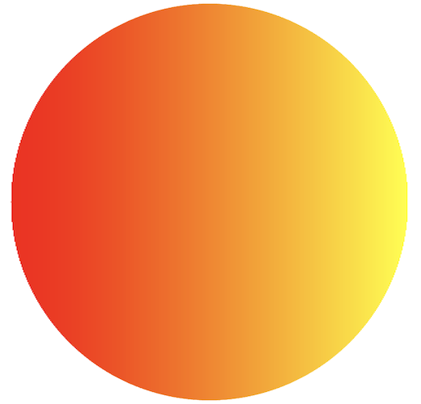
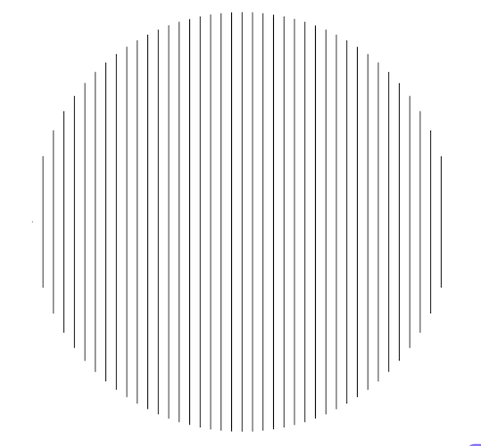
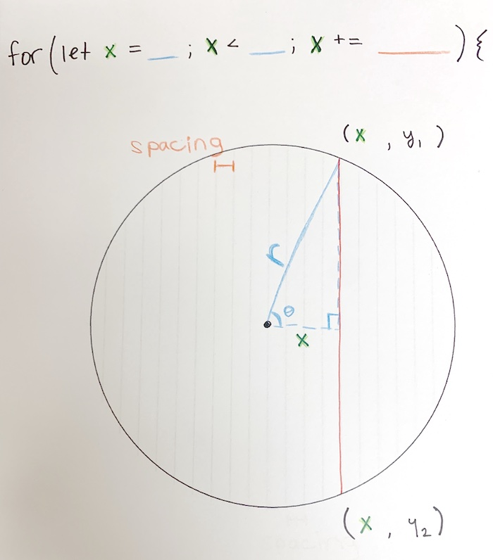
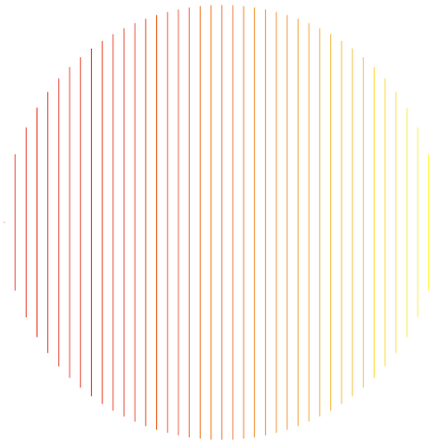

# Instructions  

**HARD GEOMETRY** - Here's what we're trying to make. *NOTICE* that the gradient goes from left to right, not radially from the center (which is a much easier problem to solve).

1. Begin by filling out the `displayCircleLines()` function, which should create the following image when called (hint: check out the trig functions on the [p5.js reference page](https://p5js.org/reference/)):  
    

Here is a little diagram that might be helpful:  
  

2. Use `lerpColor()` to apply the appropriate stroke:
  

  
3. Change the spacing in `displayCircleLines()` to finish!

  