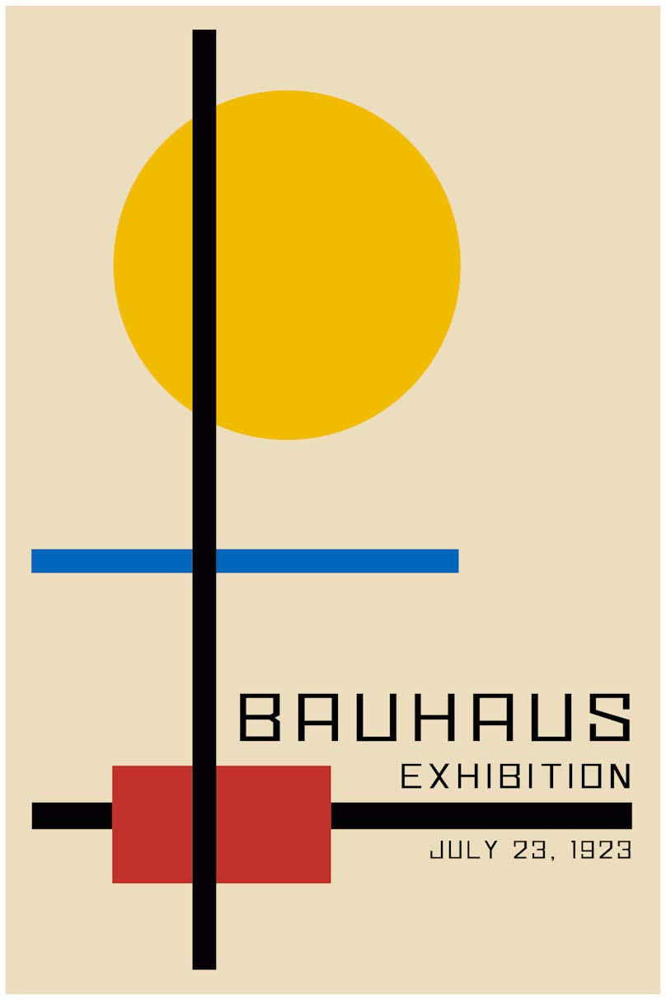
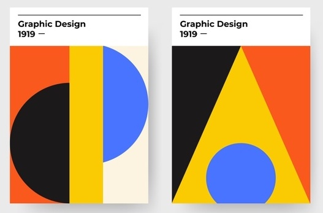
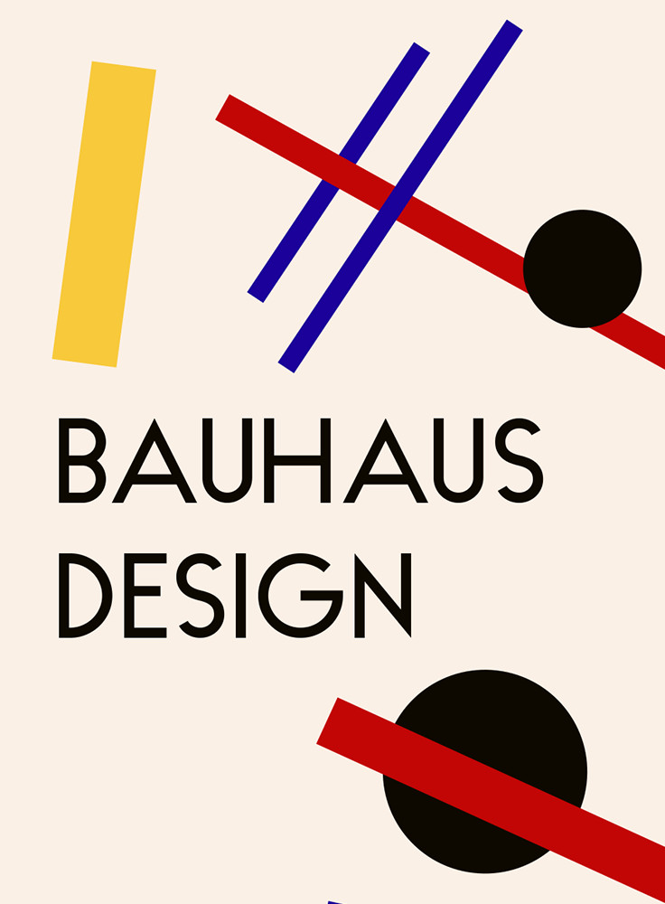
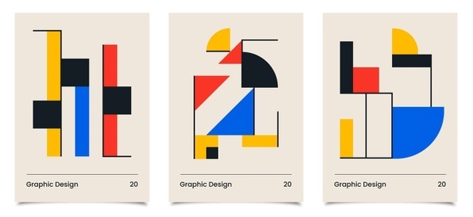
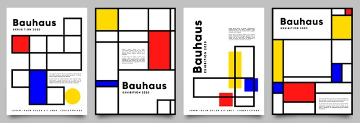
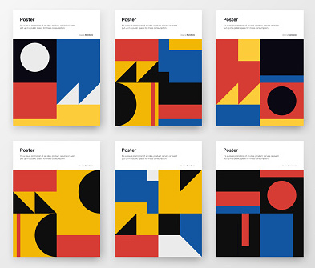
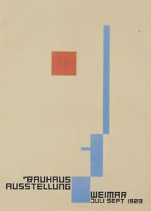

# Instructions  

We are going to create sketches **inspired by** Bauhaus design.

Required:
* fill the entire 400x600 canvas with a composition
* use **at least one** of each: circle, triangle, rectangle, line
* only 5 colors (including black and white)

Optional:
* `text()` (see below)
* `arc()` (see below)

### Examples

