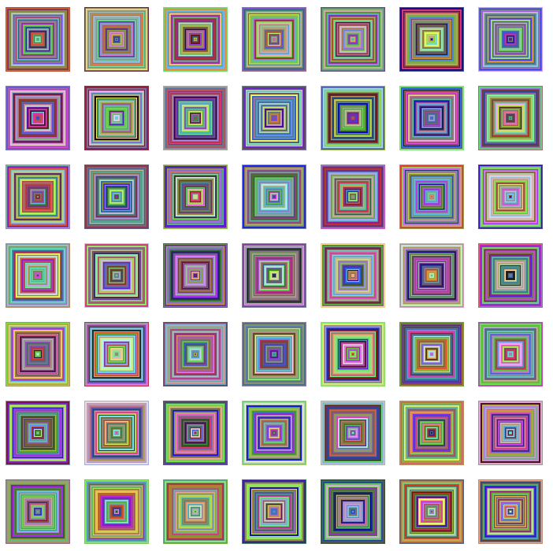

# Instructions

Vera Molnár (born 1924) is a pioneer of generative code-based art and is one of the first women to use computers to create art.

Create a composition inspired by Molnár. Your sketch must use **nested for loops**.

