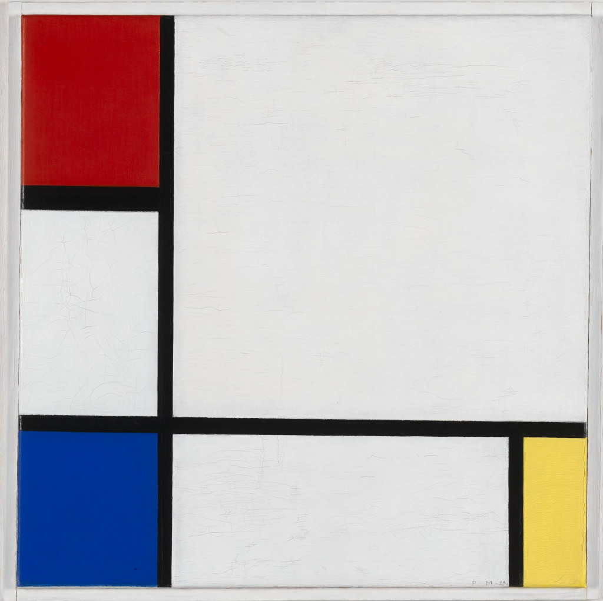

# Instructions  

We are going to create interactive sketches inspired by the geometric forms of Piet Mondrian. You can recreate [this example](https://jdeboi.com/p5js-exercises/arts/mondrian/index.html) or make your own (unique) sketch. Your shapes should: 

* respond to the mouse
* maintain geometric relationships
* use the following built-in variables: mouseX,
 mouseY, width, height

