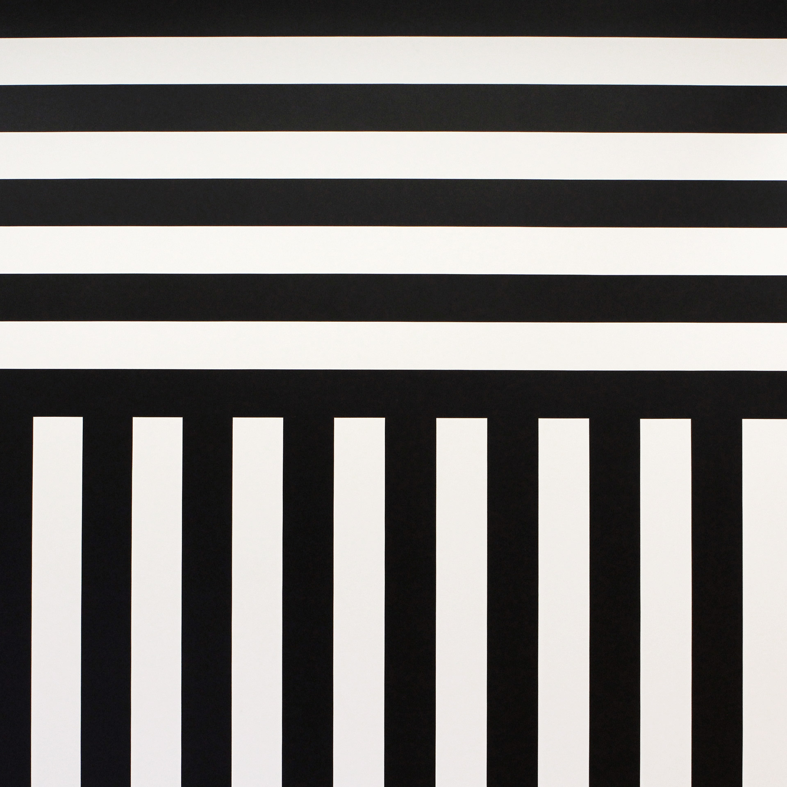
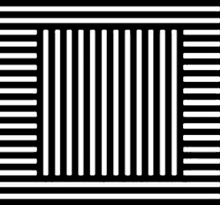
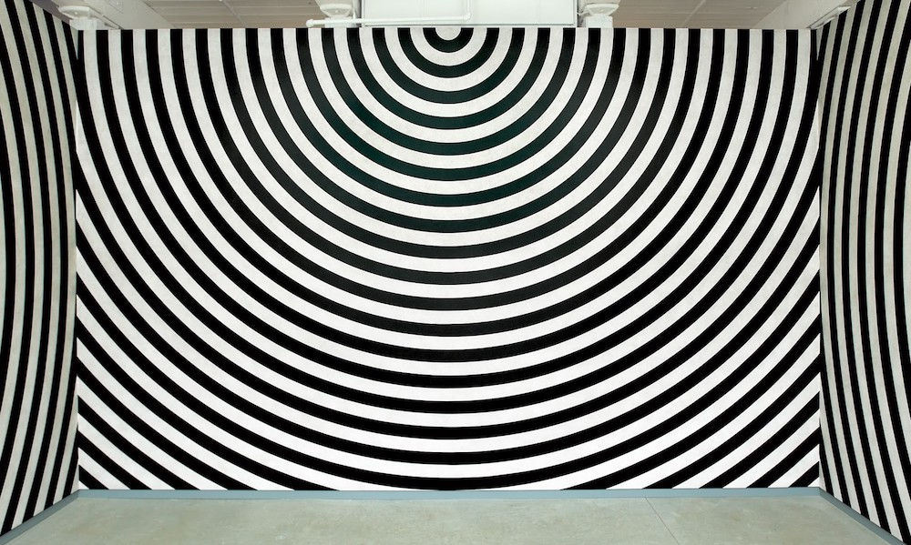

# Instructions  

Create an algorithmic sketch inspired by [Sol Lewitt](https://massmoca.org/sol-lewitt/). Your sketch must use at least one for loop: no unnecessary copy/paste - leverage loops!

### Wall Drawing 630

### Wall Drawing 370

### Wall Drawing 462

